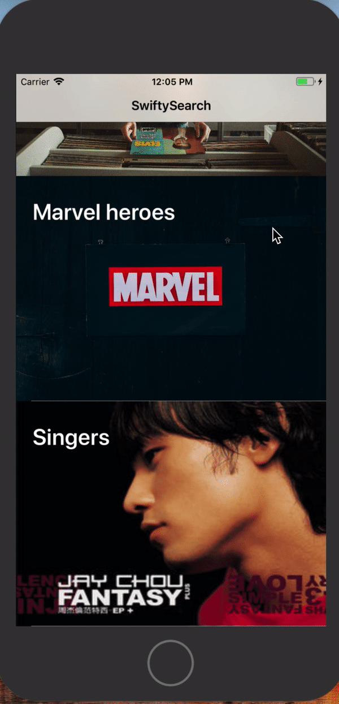
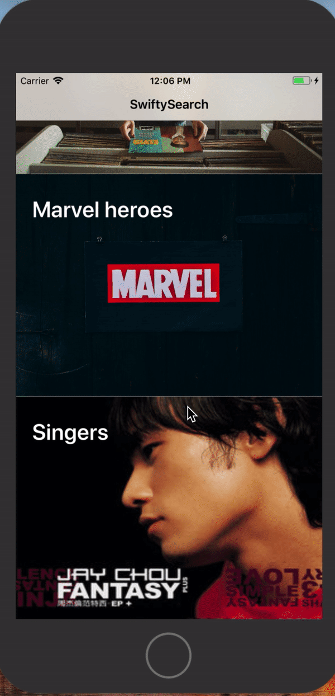

# SwiftySearch

[](http://cocoadocs.org/docsets/SwiftySearch)

Awesome iOS UISearchController with multi-feature, base on [PYSearch](https://github.com/ko1o/PYSearch).

| Base + hiddenStatusBar | Custom NavigationBar | Custom TextColor |
| ------------- | --------------- | --------------- |
|  |  |  |


## features
- [x] Support search suggestions
- [x] Support search history (record) cache
- [x] Support callback using delegate or block completion search
- [x] Support CocoaPods
- [x] Support localization

## Requirements
- iOS 9.0+
- Swift 3.0+


## Installation

#### CocoaPods
available on CocoaPods. Just add the following to your project Podfile:
```
pod 'SwiftySearch'
use_frameworks!
```


## Usage
See the code snippet below for an example of how to implement, or see the example project.

Create
Declare SwiftySearchController and custom navigationTitle/cancelTextColor/navigationTitleColor
```swift
let search: SwiftySearchController = {
            let _search = SwiftySearchController().configure {
                $0.receiveTitle = currentTitle
                $0.cancelTextColor = .blue
                $0.navigationTitleColor = .green
                $0.displayStatusBar = true
            }
            return _search
        }()
```

Custom color
```swift
            search.navigationLeftColor = .red
            search.navigationRightColor = .blue
            search.cancelTextColor = .white
```

Custom Text
```swift
            search.searchBarPlaceholder = "Avengers"
            search.cancelButtonText = "Close"
            search.receiveSearchText = "Thor"
            search.receiveHotSearchs = ["Eminem", "Macklemore", "Post Malone", "Jay Chou", "Sia", "Taylor Swift", "Kendrick Lamar"]
            search.receiveTitle = "SwiftyTitle"
```

Custom Image
```swift
           SwiftySearchCellCustom.cleanButtonIconImage = yourImage
```

Search History
```swift
           search.maxOfSearchRecords = 10
```

Set hot search
```swift
           search.hotSearchs = ["Black Widow", "Iron Man", "Captain America", "Thor", "Hulk", "Black Panther", "Hawkeye"]
```

## Bonus Customization 
```swift

    public static var cursorColor: UIColor = UIColor.Blue.mainBlue

    public static var searchRecordOptionButtonBorderColor: UIColor
 
    public static var searchRecordOptionButtonTextColor: UIColor

    public static var hotSearchOptionButtonBorderColor: UIColor

    public static var hotSearchOptionButtonTextColor: UIColor

    public static var swapSearchRecordWithHotSearch: Bool

```

Set recommendation text in Delegate
```swift
func searchBarTextDidChange(_ searchViewController: SwiftySearchController, searchBar: UISearchBar, searchText: String) {
        var recommendations: [String] = []
        switch currentIndex {
        case 0:
            recommendations = ["Indie Pop", "Jazz", "Latin", "Opera", "Vocal", "Rap"]
        case 1:
            recommendations = ["Loki", "Ronan" ,"Red Skull" ,"Ultron", "Dr.Doom", "Mystique", "Black Cat"]
        case 2:
            recommendations = ["Not Afraid", "Thrift Shop", "Congratulations", "不愛就拉倒", "Genius", "Look What You Made Me Do", "HUMBLE."]
        default:
            break;
        }
        searchViewController.receiveRecommendationTextArray = recommendations
    }

```

# IMPORTANT 
If you are going to present SwiftySearch, you need to use UINavigationController.
```swift
          let navi = UINavigationController(rootViewController: search)
          self.present(navi, animated: true, completion: nil)
```


#### Delegate
There's some trigger point you can handle using delegate. those are optional.
See [SwiftySearchController](https://github.com/vincentLin113/SwiftySearch/blob/master/SwiftySearch/Source/SwiftySearchController.swift) for more details.
  - func didSelectedRecommendation(_, index: Int,recommendationText: String,searchText: String)
    - func didSelectedHotSearch(_ , index: Int,hotSearch: String, searchText: String)
    - func didSelectedSearchRecord(_,index: Int,searchRecordText: String,searchText: String)
    - func searchBarTextDidChange(_,searchBar: UISearchBar,searchText: String)
    - func searchBarTextDidEndEditing(_ ,searchBar: UISearchBar)
    - func didSelectedCleanButton(_ ,cleanButton: UIButton)
    
## <a id="Hope"></a>Hope
- If you have many questions, you can put issue [issue](https://github.com/vincentLin113/SwiftySearch/issues/new).
    
## Photos from
- [Unsplash](https://unsplash.com)

## License
available under the MIT license. See the LICENSE file for more info.
